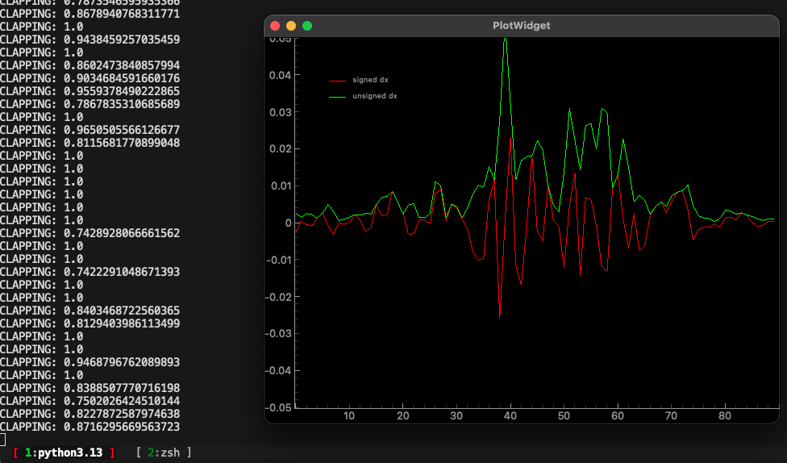

# 👏 Clap Detector

A real-time clap detection system using pose estimation (YOLO) and wrist movement analysis, visualized live with PyQtGraph.




## How It Works

The app uses a YOLO pose model to track wrist keypoints via webcam. It measures the normalized distance between wrists (relative to shoulder width) over a rolling window of frames, then computes signed and unsigned derivatives to detect clapping motion. A score above `0.7` triggers a clap detection.

## Requirements

- Python 3.9+
- `ultralytics`
- `torch`
- `pyqtgraph`
- `PySide6`

Install dependencies:

```bash
pip install ultralytics torch pyqtgraph PySide6
```

## Usage

```bash
python detect.py
```

Make sure `yolo26n-pose.pt` is in the same directory. A webcam feed will open alongside a live graph of wrist movement derivatives.

## Configuration

| Variable  | Default | Description                          |
|-----------|---------|--------------------------------------|
| `SAMPLES` | 50      | Rolling window size for wrist data   |
| `T`       | 3       | Frame window for derivative calc     |
| `TM`      | 30      | Graph history multiplier             |

## Output

- **Red line** — signed dx (net wrist direction)
- **Green line** — unsigned dx (total wrist movement)
- Console prints `CLAPPING: <score>` when a clap is detected